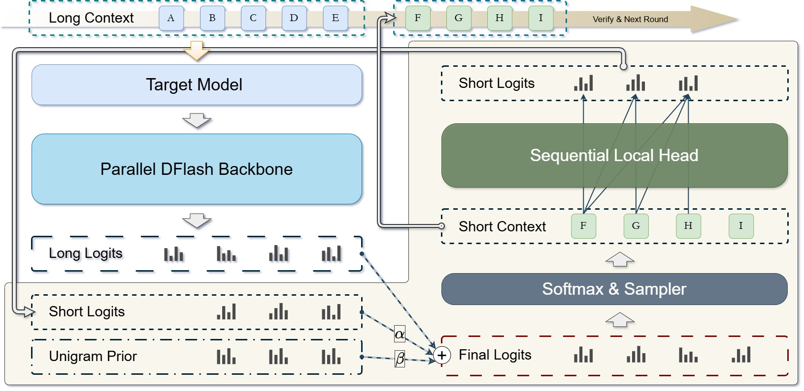

# DeLS-Spec: Decoupled Long-Short Contexts for Parallel Speculative Drafting

DeLS-Spec is a lightweight plug-in for DFlash-style speculative decoding. It keeps the DFlash drafter fixed and adds an independently trained local head to model short-range causal dependencies inside draft blocks, improving acceptance length and decoding speed with minimal training cost.

This repository contains the DeLS-Spec runtime and evaluation code. The training
code is being organized and will be released separately.



## Installation

Use Python 3.10 or newer on a CUDA GPU machine. Install a PyTorch build that
matches your CUDA driver, then install the benchmark dependencies:

```bash
python -m pip install --upgrade pip
python -m pip install -r requirements-hf.txt
```

## Checkpoints

Download the released DeLS-Spec local heads and unigram priors from Hugging Face:

```bash
huggingface-cli download dt3t/DeLS-Spec-Weights \
  --local-dir checkpoints/dels-spec
```

The release contains:

- `checkpoints/dels-spec/qwen3-4b/local_head.pt`
- `checkpoints/dels-spec/qwen3-4b/loss_mask_unigram.pt`
- `checkpoints/dels-spec/qwen3-8b/local_head.pt`
- `checkpoints/dels-spec/qwen3-8b/loss_mask_unigram.pt`

The DFlash draft checkpoints used by the examples are downloaded directly from
Hugging Face model IDs:

- `z-lab/Qwen3-4B-DFlash-b16`
- `z-lab/Qwen3-8B-DFlash-b16`

## Hugging Face Benchmark

### DFlash / Domino

```bash
CUDA_VISIBLE_DEVICES=0 \
TEMPERATURE=0.0 \
TARGET_MODEL=Qwen/Qwen3-4B \
DRAFT_MODEL=z-lab/Qwen3-4B-DFlash-b16 \
TASKS="gsm8k:128,math500:128,aime25:30,humaneval:164,mbpp:128,livecodebench:128,mt-bench:80,alpaca:128" \
MASTER_PORT=29602 \
OUT_DIR=outputs/qwen3_4b_dflash_b16_temp0 \
./run_hf_benchmark.sh
```

For a Domino draft model, replace `DRAFT_MODEL` with the corresponding Domino
checkpoint.

### DeLS-Spec

```bash
CUDA_VISIBLE_DEVICES=0 \
TEMPERATURE=0.0 \
TARGET_MODEL=Qwen/Qwen3-8B \
DRAFT_MODEL=z-lab/Qwen3-8B-DFlash-b16 \
DELS_LOCAL_HEAD=checkpoints/dels-spec/qwen3-8b/local_head.pt \
DELS_BASELINE_PATH=checkpoints/dels-spec/qwen3-8b/loss_mask_unigram.pt \
DELS_ALPHA=0.3 \
DELS_BETA=0.3 \
TASKS="gsm8k:128,math500:128,aime25:30,humaneval:164,mbpp:128,livecodebench:128,mt-bench:80,alpaca:128" \
MASTER_PORT=29603 \
OUT_DIR=outputs/qwen3_8b_dels_b16_temp0 \
./run_hf_benchmark.sh
```

`DELS_ALPHA` and `DELS_BETA` can be scalars or comma-separated per-position
schedules. If `DELS_BETA` is nonzero, `DELS_BASELINE_PATH` must point to the
loss-mask unigram prior used by the local head.

## Useful Scripts

Search DeLS-Spec alpha/beta values with the grid-search helper:

```bash
CUDA_VISIBLE_DEVICES=0 \
TARGET_MODEL=Qwen/Qwen3-8B \
DRAFT_MODEL=z-lab/Qwen3-8B-DFlash-b16 \
DELS_LOCAL_HEAD=checkpoints/dels-spec/qwen3-8b/local_head.pt \
DELS_BASELINE_PATH=checkpoints/dels-spec/qwen3-8b/loss_mask_unigram.pt \
./scan_dels_alpha_beta.sh
```

## Training

This repository is focused on DeLS-Spec inference and evaluation. The training
code is being organized and will be released separately.

## Acknowledgements

We thank the authors and maintainers of
[Domino](https://github.com/jianuo-huang/Domino),
[DFlash](https://github.com/z-lab/dflash),
[SpecForge](https://github.com/sgl-project/SpecForge),
[FlashInfer](https://github.com/flashinfer-ai/flashinfer), and
[SGLang](https://github.com/sgl-project/sglang).

## Citation

If you use DeLS-Spec in your research, please cite our paper.
